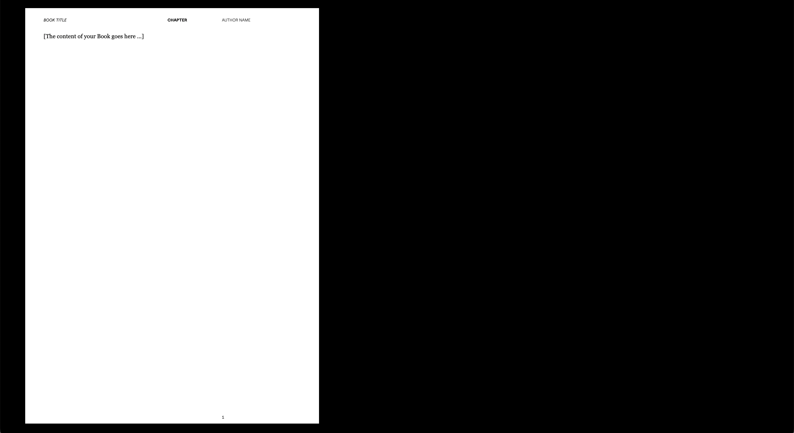

# Atlas Paged



A comprehensive React component library for creating print-ready documents with Paged.js, featuring a built-in development preview system.

## Installation

```bash
npm install atlas-paged
```

## Install Peer Dependencies

```bash
npm install react react-dom tailwindcss pagedjs
```

## Quick Start

```tsx
import { Layouter, TwoColumns, PageBreak } from "atlas-paged";
import "atlas-paged/styles"; // Import fonts
import "atlas-paged/print.css"; // Import print styles

function MyDocument() {
  return (
    <div>
      <div id="pagedjsdocroot" style={{ display: "none" }}>
        <TwoColumns>
          <p>Your content here...</p>
        </TwoColumns>
        <PageBreak />
        <p>Next page content...</p>
      </div>

      <div id="preview"></div>
      <Layouter />
    </div>
  );
}
```

## Available Components

### Layout Components

- `TwoColumns` - Two-column layout
- `ThreeColumnsLeft` - Three-column layout with emphasis on left
- `ThreeColumnsCenter` - Three-column layout with emphasis on center
- `ThreeColumnsRight` - Three-column layout with emphasis on right

### Typography

- `H1`, `H2`, `H3`, `H4`, `H5`, `H6` - Styled headings
- `P` - Paragraph component

### Visual Elements

- `PageBreak` - Force page breaks
- `Divider` - Visual dividers

### Page Components

- `PageNumeration` - Page numbering
- `Layouter` - Main layout engine

### Development Tools

- `Navigation` - Preview navigation
- `LoremIpsum` - Lorem ipsum generator
- `ChapterName` - Chapter naming utility

## Development Workflow

For development with live preview:

```tsx
import { TwoColumnsPage } from "atlas-paged";

function App() {
  return (
    <div>
      <TwoColumnsPage /> {/* Your preview pages */}
    </div>
  );
}
```

## Technologies Used

React, Vite, TypeScript, Paged.js, Tailwind CSS

This is a comprehensive component library for creating print-ready documents with Paged.js and React. It includes Tailwind CSS integration and TypeScript support, making it easy to build complex, print-ready documents with a custom component architecture.

## License

MIT © Max Schmalenbach
